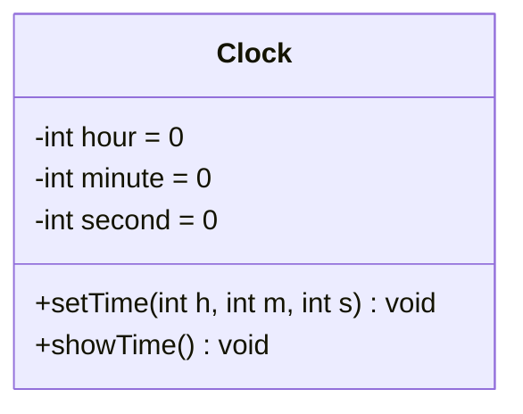
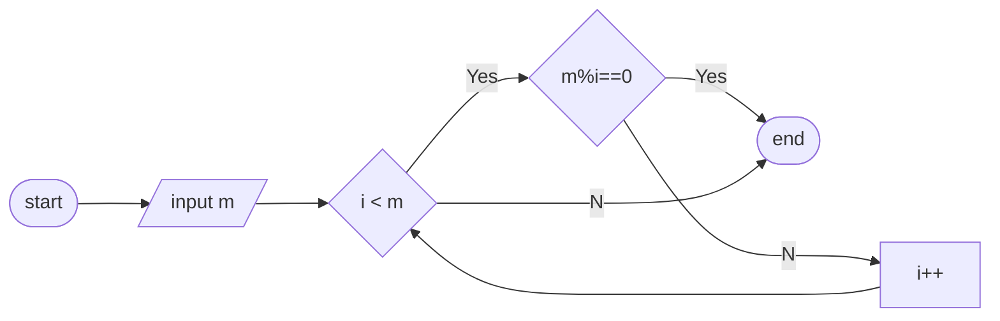
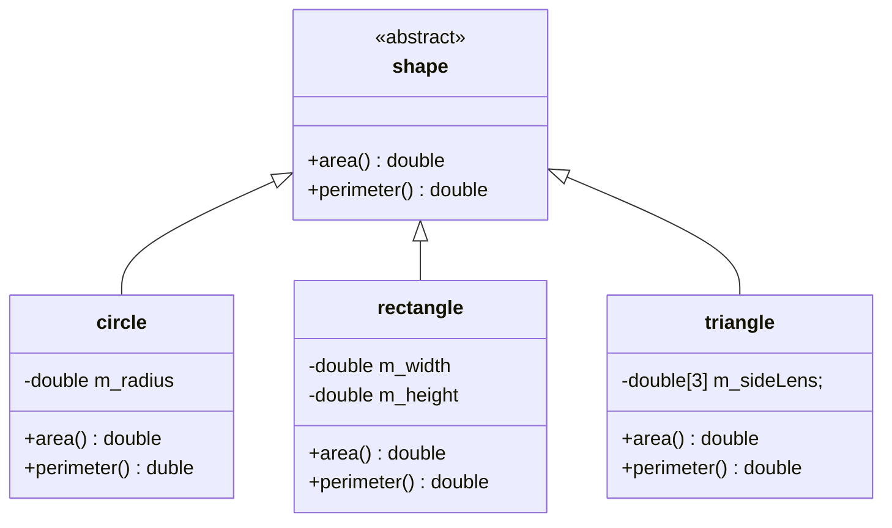
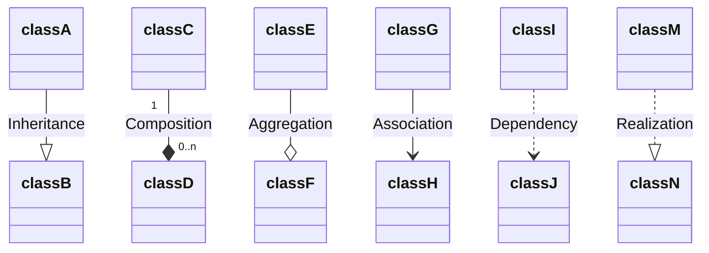
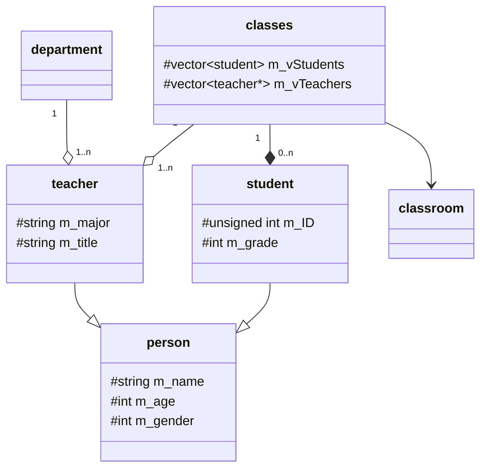

<!--
 * @Description: 
 * @Version: 1.0
 * @Author: Wang Hongping
 * @Date: 2024-03-17 08:32:06
 * @LastEditors: Wang Hongping
 * @LastEditTime: 2024-03-19 14:05:38
-->
# class diagrams

## single class
---
title: class Clock
---

---
title: flowchart
---

## class relations
---
title: shapes
---

---
title: Relationships
---
|Type|Description|
|---|---|
|<\|--|Inheritance|

markdown

---
title: School class relationship
---
