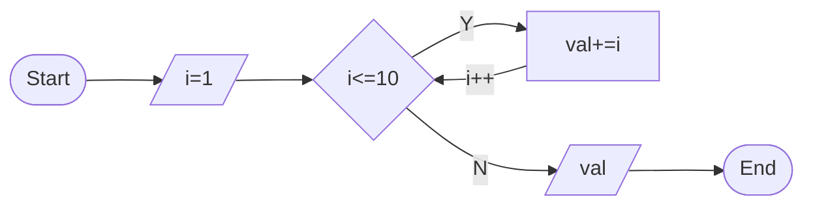
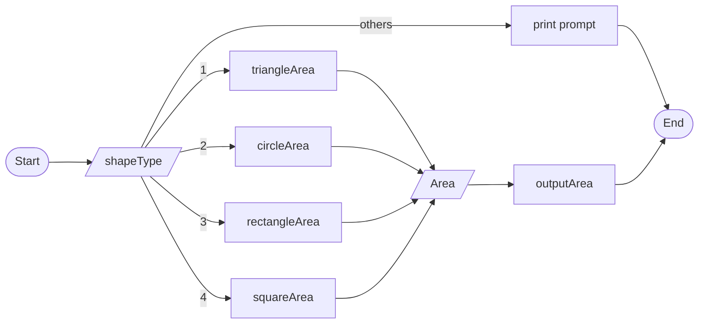
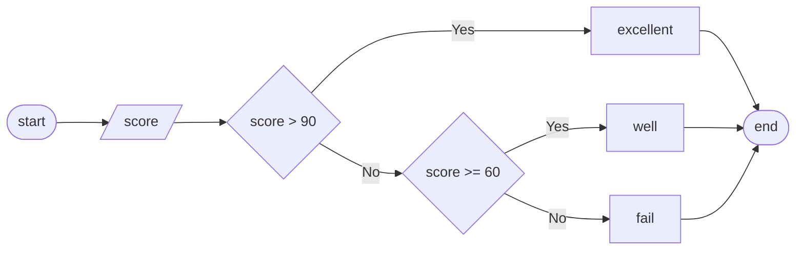
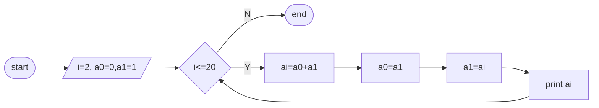
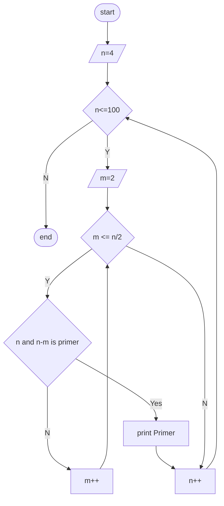
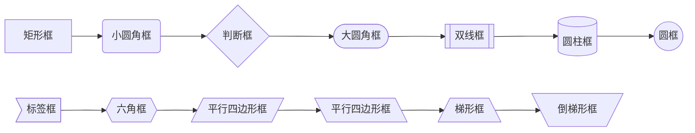

# 实习一 解析

## Installing Visual Code Source
Include Addons: 
- Markdown All in One
- Markdown Preview Enhanced
- Markdown Preview Mermaid Support


## 1.1 do-while loop
1. 用 do-while 语句编程，求自然数 1 ~10 之和。程序正确运行之后，去掉源程序中 #include 语句，重新编译，观察会有什么问题。


```c++
#include <iostream>
int main()
{
    int val = 0;
    int i=1;
    do
    {
        val += i;
    }while(++i<=10);
    std::cout << val << std::endl;
    return 0;
}
```

## 1.2 for loop
2. 将 do-while 语句用 for 语句代替，完成相同的功能。
```c++
#include <iostream>
int main()
{
    int val = 0;
    for (int i=1; i<=10; i++)
    {
        val += i;
    }
    std::cout << val << std::endl;
    return 0;
}
```

## 1.3 shape area caculation
1. 编程计算图形的面积。程序可计算三角形、圆形、长方形、正方形的面积，运行时先提示用户选译图形的类型，然后，对三角形要求输入三条边长，对圆形要求用户输入半径值，对长方形要求用户输入长和宽的值，对正方形要求用户输入边长的值，计算出面积的值后将其显示出来。


```c++
#include <iostream>
#include <cmath>    //sqrt

constexpr double PI = 3.14159265358979323846;

int main()
{
    int     shapeType = 0;
    double  areaShape = 0.0;
    
    std::cin >> shapeType;
    switch(shapeType)
    {
        case 1: //Triangle
        { //local variable
            double  a, b, c, s;
            do{
                std::cin >> a >> b >> c;
                if (a+b>c && a+c>b && b+c>a)
                {
                    s = (a+b+c)/2.;
                    areaShape = sqrt(s*(s-a)*(s-b)*(s-c));
                    std::cout << "Triangle Area:" << areaShape << std::endl;
                }
                else
                {
                    std::cerr << "input correct length of triangle." << std::endl;
                }
            }while(a+b<=c || a+c<=b || b+c<=a);
        }
        break;

        case 2: //Circle
        {
            double  radius;
            std::cin >> radius;
            areaShape = PI*radius*radius;
            std::cout << "Circle Area: " << areaShape;
        }
        break;

        case 3: //Rectangle
        {
            double  width, height;
            std::cin >> width >> height;
            areaShape = width*height;
            std::cout << "Rectangle Area: " << areaShape;
        }
        break;

        case 4: //Square
        {
            double  lenEdge;
            std::cin >> lenEdge;
            areaShape = lenEdge*lenEdge;
            std::cout << "Square Area" << areaShape;
        }
        break;

        default://Others
        {
            std::cout << "Input valid shape type(1~4)." << std::endl;
        }
        break;
    }

    return 0;
}
```
## 1.4 debug
4. 使用 debug 调试功能观察任务 3 程序运行中变量值的变化情况。
```
Visual Studio
F5 - Run Debug
F9 - breaking point
F10 - Step over
F11 - Step into
Watch Variables
```

## 1.5 time struct
5. 定义一个表示时间的结构体，可以精确表示年、月、日、小时、分、秒；提示用户输入年、月、日、小时、分、秒的值，然后完整地显示出来。
```c++
#include <iostream>
struct time{
    int     year;
    int     month;
    int     day;
    int     hour;
    int     minute;
    double  second;
};
int main()
{
    time    tm;
    std::cin >> tm.year >> tm.month >> tm.day >> tm.hour >> tm.minute >> tm.second;
    std::cout << tm.year << "-" << tm.month <<"-" << tm.day <<" ";
    std::cout << tm.hour << ":" << tm.minute <<":" << tm.second << std::endl;
}
```

参数检查的版本
```c++
#include <iostream>

int getMonthDays(int year, int month)
{
	int	days = 30;

	switch (month)
	{
	case 1: case 3: case 5: case 7: case 8: case 10: case 12:
		days = 31;
		break;
	case 2:
		days = ((year%4==0 && year%100!=0) || year%400==0) ? 29 : 28;
		break;
	default:
		days = 30;
		break;
	}

	return days;
}

int main()
{
	time    tm;

	do {
		std::cin >> tm.year;
	} while (tm.year < 1);

	do {
		std::cin >> tm.month;
	} while (tm.month < 1 || tm.month>12);

	do {
		std::cin >> tm.day;
	} while (tm.day < 1 || tm.day>getMonthDays(tm.year, tm.month));

	do {
		std::cin >> tm.hour;
	} while (tm.hour < 0 || tm.hour>23);

	do {
		std::cin >> tm.minute;
	} while (tm.minute < 0 || tm.minute>59);

	do {
		std::cin >> tm.second;
	} while (tm.second < 0 || tm.second>59);

	std::cout << tm.year << "-" << tm.month << "-" << tm.day << " ";
	std::cout << tm.hour << ":" << tm.minute << ":" << tm.second << std::endl;
}
```

## 1.6 score
6. 输入成绩，根据成绩的好坏输出相应评语。如果成绩在 90 分以上，输出评语：优秀。如果成绩在 60 分到90 分之间，输出评语：良好。如果成绩不足 60 分，输出评语：不及格。
---
title: flow chart
---


---
title: code example
---
```c++
#include <iostream>
int main()
{
    int     score;
    if (score > 90)
    {
        std::cout << "excellent" << std::endl;
    }
    else if (score >=60)
    {
        std::cout << "well" << std::endl;
    }
    else
    {
        std::cout << "fail" << std::endl;
    }

    return 0;
}
```

## 1.7 fibonacci
7. 使用 for, while, do-while 循环，求菲波拉契数列 $a_0, a_1, a_2, \dots, a_{20}$。$a_0 = 0, a_1 = 1, a_2 = a_1 + a_0, a_3 = a_2 + a_1, \dots, a_n = a_{n−1} + a_{n−2}；如 0, 1, 1, 2, 3, 5, 8, 13, 21, \dots$。


```c++
// for loop
#include <iostream>
int main()
{
    int     a0=0, a1=1, ai;
    std::cout << a0 << "," << a1;
    for (int i=2; i<=20; ++i)
    {
        ai = a0+a1;
        a0 = a1;
        a1 = ai;
        std::cout << "," << ai;
    }
    std::cout << std::endl;
    return 0;
}
```
```c++
// while loop
#include <iostream>
int main()
{
    int     i = 2;
    int     a0=0, a1=1, ai;
    std::cout << a0 << "," << a1;
    while(i++<=20)
    {
        ai = a0+a1;
        a0 = a1;
        a1 = ai;
        std::cout << "," << ai;
    }
    std::cout << std::endl;
    return 0;
}
```

```c++
// do-while loop
#include <iostream>
int main()
{
    int     i = 2;
    int     a0=0, a1=1, ai;
    std::cout << a0 << "," << a1;
    do
    {
        ai = a0+a1;
        a0 = a1;
        a1 = ai;
        std::cout << "," << ai;
    }while(++i<=20);

    std::cout << std::endl;
    return 0;
}
```

## 1.8
8. 哥德巴赫猜想（任何充分大的偶数都可由两个素数之和表示）。将 4-100 中的所有偶数分别用两个素数之
和表示。输出为：
4=2+2
6=3+3
...
100=3+97



```c++
#include <iostream>

bool isPrimer(int m)
{
    int     i=2;
    while(i<m)
    {
        if (m%i == 0)
            break;
        i++;
    }

    return i==m;
}

int main()
{
    int     m, n;
    for (n=4; n<=100; ++n)
    {
        for (m=2; m<=n/2; ++m)
        {
            if (isPrimer(m) && isPrimer(n-m))
            {
                std::cout << n << "=" << m << "+" << n-m << std::endl;
                break;
            }
        }
    }
    return 0;
}
```

## 1.9 multiplication table
9. 输出九九乘法表，要求成下三角，= 与结果右对齐，示例如下：
1\*1=1
2\*1=2 2\*2= 4
3\*1=3 3\*2= 6 3\*3= 9
4\*1=4 4\*2= 8 4\*3=12 4\*4=16
5\*1=5 5\*2=10 5\*3=15 5\*4=20




[1] mermaid 语法 <https://mermaid.js.org/syntax/flowchart.html>