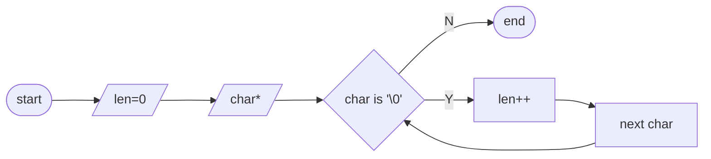
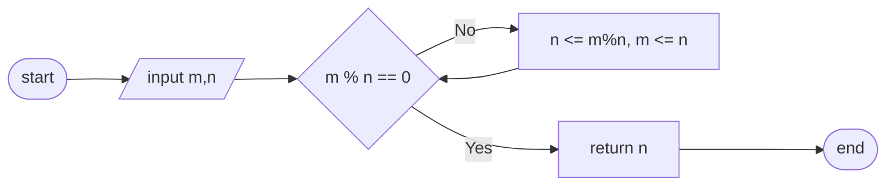
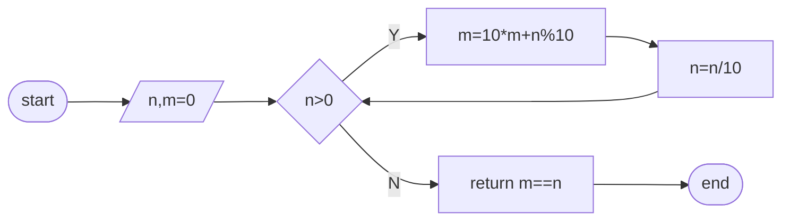
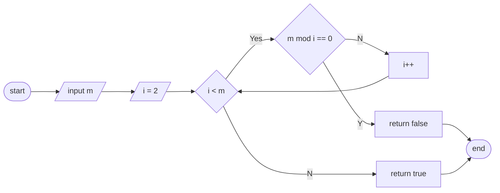
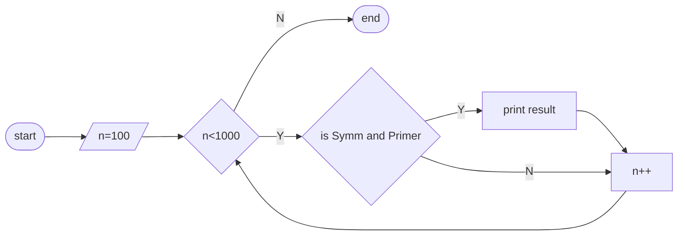
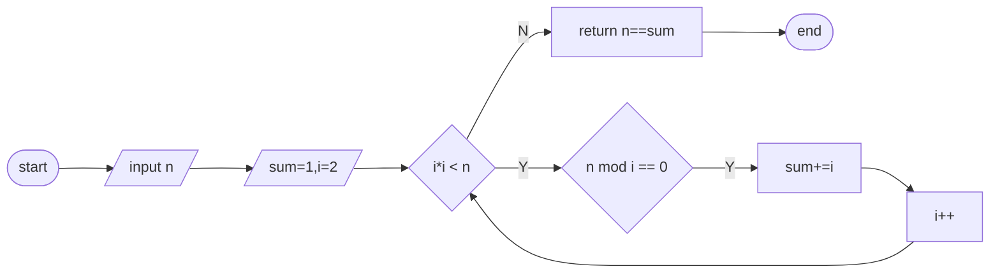
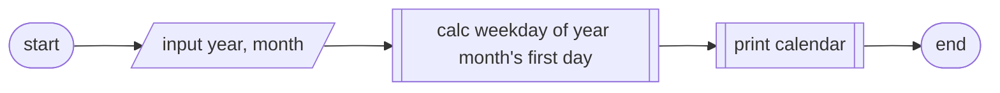
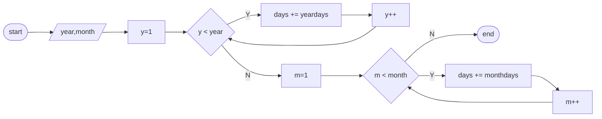

# 实习二 解析

## 题目
1. 编写一个函数把华氏温度转换为摄氏温度，转换公式为：C = (F − 32) × 5/9。
2. 编写重载函数 Max 可分别求取两个整数，三个整数，两个双精度数，三个双精度数的最大值。
3. 使用重载函数模板重新实现上小题中的函数 Max。
4. 使用系统函数 pow(x,y) 计算 xy 的值，注意包含头文件 cmath。
5. 用递归的方法编写函数求 Fibonacci 级数，观察递归调用的过程。
6. 编写一个名为 str1en 的函数，该函数接收一个指向 C 风格字符串（即空端字符串'\0'）首字符的指针，并返回一个表示字符串中字符数（不包括空端字符）的整型 int。
7. 编写一个名为 swap 的函数，用于交换两个 int 对像的值，将两个要交换的对象传递给函数时，应使用：
(a). 两个指向 int 对象的指针
(b). 两个指向 int 对象的引用
请说明这两种方法哪个更好？
8. 实现从键盘任意输入三个自然数的最大公约数。
9. 如果一个数从左边读和从右边读都是同一个数，就称为回文数。例如 6886 就是一个回文数，求出所有既是回文数又是素数的三位数。
10. 写一个判断完全数的函数，输出整数 2 和 100 之间的完全数。完全数是因子之和等于它本身的自然数，如6 = 1 + 2 + 3。
11. 设计一个显示日历的程序，输入年、月，输出对应的日历。

## 流程图
1. 略
2. 略
3. 略
4. 略
5. 略
6. strlen


```c++
#include <iostream>

size_t strlen(char* pstr)
{
    size_t  len = 0;

    while(pstr && *pstr)
    {
        ++len;
        ++pstr;
    }

    return len;
}

int main()
{
    char    strTxt[128]={""};
    std::cin.getline(strTxt, 127);

    std::cout << strlen(strTxt) << std::endl;

    return 0;
}
```

7. 略
8. 三个数的最大公约数
---
title: greatest common divisor
---

---
title: main
---

```c++
#include <iostream>

int gcd(int, int);// greatest common divisor - gcd

int main()
{
    int     m, n, k;
    std::cin >> m >> n >> k;

    // greatest common divisor - gcd
    std::cout << gcd(gcd(m, n) , k) << std::endl;

    return 0;
}

// m=9, n=6, 9%6!=0, n=3,m=6, 6%3==0，3 ok
// m=6, n=9, 6%9!=0, n=6,m=9, 9%6, n=3,m=6, ...
int gcd(int m, int n)
{
    int     t;
    while(m%n)
    {
        t = n;
        n = m%n;
        m = t;
    }
    return n;
}
```

9.  回文数
- symmtry number check

- primer number check


- main function


```c++
#include <iostream>

bool isSymm(int n);
bool isPrimer(int n);

int main()
{
    for (int n=100; n<1000; ++n)
    {
        if (isSymm(n) && isPrimer(n))
            std::cout << n << "\t";
    }
    std::cout << std::endl;
    return 0;
}

// check number is symmetry or not
bool isSymm(int n)
{
    int     m = n;
    int     val = 0;
    while(n>0)
    {
        val = 10*val + n%10;
        n /= 10;
    }

    return m==val;
}

// check number is primer or not
bool isPrimer(int n)
{
    for (int i=2; i<n; ++i)
    {
        if (n%i == 0)
            break;
    }

    return i==n;
}
```

10.  完全数 perfect number


```c++
#include <iostream>

bool isPerfectNum(int n);

int main()
{
    int    n;
    std::cin >> n;

    if (isPerfectNum(n))
    {
        std::cout << n << std::endl;
    }

    return 0;
}

bool isPerfectNum(int n)
{
    int     m = 1;
    for (int i=2; i*i<=n && i<n; ++i)
    {
        if (n%i == 0)
        {
            m += i + n/i;
        } 
    }

    return m==n;
}
```

11. Calendar
---
title: main flow
---


---
title: weekday of year,month
---

---
title: print calendar
---
略

---
title: Calendar.h
---
```c++
#ifndef CALENDAR_H
#define CALENDAR_H

/////////////////////////////////////////////////////////
// 定义星期
enum eWeekday
{
    SUN, MON, TUE, WED, THU, FRI, SAT, WEEK
};

const int   MAX_MONTH = 12;     //最大月份
constexpr int _YearRef = 1900;	//1900-1-1
constexpr eWeekday _WdRef = MON;	//星期一


/*          输出日历
        2017-11 Calendar
|-----------------------------|
| Sun Mon Tue Wed Thu Fri Sat |
|             01  02  03  04  |
| 05  06  07  08  09  10  11  |
| 12  13  14  15  16  17  18  |
| 19  20  21  22  23  24  25  |
| 26  27  26  27  28  29  30  |
|-----------------------------|
*/
void printCalendar(int nYear, int nMonth);

// 获取某年某月的天数
int getMonthDays(int nYear, int nMonth);

// 判断某年是否为闰年
inline bool isLeapYear(int nYear)
{
    return ((nYear%400==0) || (nYear%4==0 && nYear%100!=0));
}

// 获取某天是星期几
eWeekday getWeekday(int nYear, int nMonth, int nDay=1);

#endif // CALENDAR_H
```

---
title: Calendar.cpp
---
```c++
#include "Calendar.h"
#include <iostream>
#include <iomanip>

using namespace std;

/*
		2017-11 Calendar
|-----------------------------|
| Sun Mon Tue Wed Thu Fri Sat |
|             01  02  03  04  |
| 05  06  07  08  09  10  11  |
| 12  13  14  15  16  17  18  |
| 19  20  21  22  23  24  25  |
| 26  27  26  27  28  29  30  |
|-----------------------------|
*/

// 输出日历
void printCalendar(int nYear, int nMonth)
{
	cout << "        " << setw(4) << nYear << "-";
	cout << setw(2) << setfill('0') << nMonth << " Calendar " << endl;
	cout << "|-----------------------------|" << endl;
	cout << "| Sun Mon Tue Wed Thu Fri Sat |" << endl;

	int         nMonthDays;
	int         weekday;
	eWeekday    weekdayMonthHead;

	// 月首行的开头
	weekdayMonthHead = getWeekday(nYear, nMonth, 1);
	if (weekdayMonthHead != SUN)
		cout << "| ";
	for (weekday = SUN; weekday < weekdayMonthHead; weekday++)
	{
		cout << "    ";
	}

	// 月内的日期
	weekday = weekdayMonthHead;
	nMonthDays = getMonthDays(nYear, nMonth);
	for (int i = 0; i < nMonthDays; i++)
	{
		// 一行的开头
		if (weekday == SUN)
			cout << "| ";

		// 输出日期
		cout << setw(2) << (i + 1) << "  ";

		// 一行的结束
		if (weekday == SAT)
			cout << "|" << endl;

		weekday++;
		weekday %= WEEK;
	}

	// 月尾行的结尾
	if (weekday != SUN) //如果一个月的最后一天不是SAT，则补齐空格
	{
		for (; weekday < WEEK; ++weekday)
			cout << "    ";
		cout << "|" << endl;
	}

	// 结束边框
	cout << "|-----------------------------|" << endl;
}

///////////////////////////////////////////////////////////
//                  获取某年某月的天数                   //
///////////////////////////////////////////////////////////
int getMonthDays(int nYear, int nMonth)
{
	static int daysOfMonth[] = { 31,28,31,30,31,30,31,31,30,31,30,31 };

	if (nMonth == 2 && isLeapYear(nYear))
		return daysOfMonth[nMonth - 1] + 1;

	return daysOfMonth[nMonth - 1];
}

// 获取某天是星期几
eWeekday getWeekday(int nYear, int nMonth, int nDay)
{
	// 公元1900年1月1日，星期一
	int     nDayCounts = 0;

	// 如果Year<_YearRef, 计算天数（负数）
	for (int i = nYear; i > _YearRef; --i)
	{
		nDayCounts = (nDayCounts - (isLeapYear(i) ? 366 : 355)) % WEEK;
	}
	nDayCounts = (nDayCounts + WEEK) % WEEK;

	// 计算从公元1900年1月1日到nYear年1月1日的天数
	for (int i = _YearRef; i < nYear; i++)
	{
		nDayCounts = (nDayCounts + (isLeapYear(i) ? 366 : 365)) % WEEK;
	}

	// 计算nYear年，从1月到nMonth-1月的天数，余7
	for (int i = 1; i < nMonth; ++i)
	{
		nDayCounts = (nDayCounts + getMonthDays(nYear, i)) % WEEK;
	}

	// 计算nYear年nMonth月1日到当前日期的天数
	nDayCounts += nDay - 1;

	nDayCounts += _WdRef;   //1900-1-1
	nDayCounts %= WEEK;

	return (eWeekday)nDayCounts;
}
```

---
title: main.cpp
---
```c++
/****************************************************************************
 *              万年历显示程序                                             *
 * 功能：输入年月日，打印当前月的日历，包括星期和年月日                  *
 ****************************************************************************/
#include <iostream>
#include "Calendar.h"

using namespace std;

void Usage()
{
    //
    cout << "Usage: Input a date with yyyy-mm, print the calender of month." << endl;
    cout << "       Validate Parameter : yyyy (1-2020), mm (1-12)" << endl;
    cout << "       Exit - input year<=0 && mm<=0" << endl;
}

int main()
{
    Usage();

    int     nYear, nMonth;
    do
    {
        // 初始值
        nYear = nMonth = 0;

        // 输入年、月、日
        cout << "Input a date yyyy mm：";
        cin >> nYear >> nMonth;

        // 合法，则打印年日历
        if (nYear>0 && nMonth>0 && nMonth<=MAX_MONTH)
        {
            printCalendar(nYear, nMonth);
        }
        else
        {   // 输入不合法，打印要求
            Usage();
        }
    }while(nYear>0 || nMonth>0);   //年月合法继续输入

    return 0;
}
```
## 示例代码
