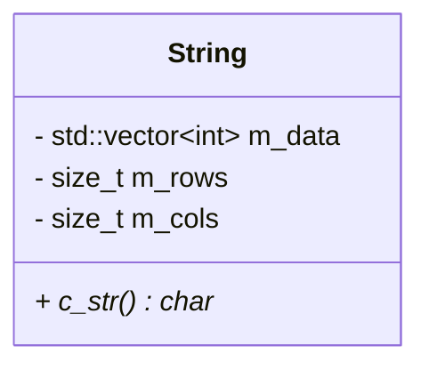

# 实习四 类与对象 解析

## 题目
1. 实现具有整数计数器的类Counter。该类应满足以下要求：
    \begin{enumerate}
        \item 提供一个构造函数，该构造函数接收一个用于初始化计数器值的 int 参数值。
        该参数的默认值应为零。
        \item 提供前缀递增和后缀递增操作符重载函数。
        \item 提供一个成员函数 getValue，用于返回当前的计数器值。
    \end{enumerate}
    此外，该类必须跟踪当前存在多少个计数器对象。应提供查询计数的方法。
    代码不得使用任何全局变量。（提示：使用静态成员）。

    \item 写一个 Histogram 类来执行直方图计算（即计算每个间隔中有多少个值）。类应满足以下要求：
    \begin{enumerate}
        \item 提供一个构造函数，该构造函数采用std::vector<double> 来指定直方图边界。 
        std::vector 的元素必须严格单调递增。例如：std::vector<double>\{0.3, 3.14, 20.0, 42.42\}
        将创建一个具有三个级别的直方图，分别对应于区间$[0, 3.14),[3.14, 20)$ 和 $[20, 42.42)$。
        
        \item 提供成员函数 clear，用于清除直方图统计值。
        \item 提供成员函数 update，将新的数据值添加到直方图统计中。
        该函数要能够以某种适当的方式处理超出范围的数据。
        \item 提供一个成员函数 display，将直方图的内容输出到标准输出流（即 std::ostream）。
        \item 不提供默认构造函数。
        \item 提供移动和复制构造函数、移动和复制赋值运算符以及析构函数。
        \item 所有数据成员都是私有的。
    \end{enumerate}
    编写一个程序来全面测试直方图类。

2. 编写 Integer 类，其行为与内置整数类型 int 类似，不同之处在于： 
    1）加法和减法的含义相反； 2）乘法和除法的含义颠倒。 Integer类应满足以下要求：
    \begin{enumerate}
        \item 提供一个构造函数，该构造函数采用单个 int 参数，用于初始化 Integer，该参数应默认为零。
        \item 提供移动和复制构造函数、移动和复制赋值运算符以及析构函数。
        \item 重载以下所有运算符：加法、减法、乘法、除法、+=、-=、*= 和 /=。
        \item 提供输出流操作符函数（即 std::ostream）。 
        \item 提供输入流操作符函数（即 std::istream）读取整数。
        \item 所有数据成员都应该是私有的。
    \end{enumerate}
    另外，使用下面的程序测试 Integer 类。
    \lstinputlisting[language=c++]{code/Integer_test.cpp}

3. 编写表示有理数的 Rational 类（即 $\frac{x}{y}$ 形式的数，其中$x$和$y$为整数，
    且$y\neq0$）。该类应满足以下要求： 
    \begin{enumerate}
        \item 提供整型分子和分母成员。
        \item 提供一个接收两个整型参数的构造函数，分别对应有理数的分子和分母值。
        第一个参数的默认值应为 0。第二个参数的默认值应为 1。
        \item 提供移动和复制构造函数、移动和复制赋值运算符以及一个析构函数。
        \item 提供 +=、-=、*= 和 /= 操作符函数。
        \item 提供强制转换为 double 成员函数，返回有理数的最佳浮点近似值。
        \item 提供操作符$<<$，使用类似\"-15/23\"的格式将有理数写入输出流（std::ostream）。
        \item 简化有理数的分子和分母。
        \item 所有数据成员都是私有的。
    \end{enumerate}
    测试Rational类的函数，确保代码正确运行。
    \lstinputlisting[language=c++]{code/oop_rational_test.cpp}
    
4. 编写一个类 Point2D，它表示具有 double 坐标的二维点。提供如下所示的接口。
    \lstinputlisting[language=c++]{code/Point2D_class.cpp}
    编写一个程序，从标准输入读取点，将它们转换为 (1.5, −1.5)，然后将它们写入标准输出。
    当到达 EOF 时，程序应终止。使用 += 或 -= 执行平移。

5. 编写一个表示二维整数数组的类 IntArray2。类应满足以下要求： 
    1. 提供一个默认构造函数来创建一个空（即 0 × 0）数组。
    2. 提供一个构造函数，该构造函数采用与要创建的数组的宽度和高度相对应的两个参数。
    3. 可使用std::vector 类模板存储数组的元素。
    4. 提供可移动和可复制的拷贝构造函数。 
    5. 提供成员函数来查询数组的宽度、高度和大小（即元素数量）。
    6. 提供对数组第 (x, y) 个元素的访问。
    7. 提供输出流操作符 <<，以便可以将数组写入输出流（std::ostream）。
    8. 提供输入流操作符 >>，以便可以从输入流（std::istream）读取数组。
    9. 所有数据成员都应该是私有的。 
    编写一个程序来彻底测试 IntArray2 类。


6. 编写一个 String 类来表示零个或多个字符的序列（即字符串）。任何字符都可以出现在字符串中，包括空字符（即"\\0"）。String 类满足以下要求： 
   1. 提供一个默认构造函数来创建空字符串。
   2. 提供一个构造函数，它将指向空终止字符串的指针作为参数，以初始化要创建的对象。
   3. std::vector 类模板可用于存储底层字符串数据。
   4. 类的对象必须是可移动和可复制的。 
   5. 运算符 += 和 + 应该执行字符串连接。
   6. 提供下标运算符[]访问字符串中的单个字符。
   7. 提供输出流操作符 <<，以便可以将字符串写入输出流（std::ostream）。
   8. 提供输入流操作符 >>，以便可以从输入流（std::istream）读取字符串。
   9. 成员函数 c\_str 应该返回一个指向与 String 对象的当前值相对应的以 null 结尾的字符串的指针。
   10. 更具体地说，以 null 结尾的字符串应该相当于附加了 null 字符的 String 对象的内容。 
   11. 成员函数 size 应返回字符串中的字符数。
    使用下面的程序测试 String 类的功能。


```c++
char    str[128]="Hello";   //str is array 128 char
char* pstr = str;

//str Hello 5
while(*pstr)
{
    ++count;
    pstr++;
}
```