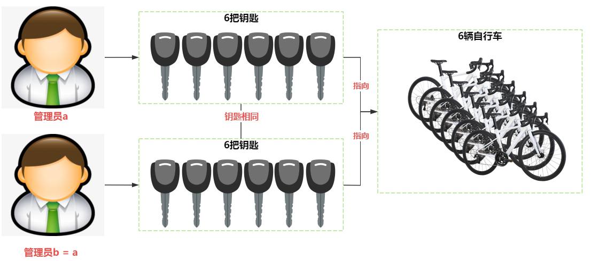
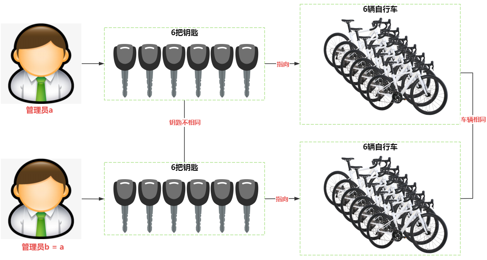

# 有关指针
[TOC]

## 指针的类型
|类型|定义|
|:---:|---|
|指针变量|Type* ptr|
|指针常量|Type* const cptr|
|指向常量的指针变量|const Type* ptr|
|指向常量的指针常量|const Type* const ptr|
|指向多维数组的指针变量|Type (*ptr)[5]|
|指针数组|Type *aptr[5]|
|函数的指针|Type (*pfun)(…)|
|多级指针|Type **pptr|

## 指针的用法
### 指针变量
简而言之，**指针即地址**。假如你有一辆自行车对象，我们可以通过**对象的名称**来访问这辆自行车。除此以外，我们还可以通过这辆自行车的**钥匙**来访问这辆自行车对象，此时的这把钥匙可以类比为**自行车对象的地址**。

C++的指针与此类似，定义一个指针，指向一个对象的地址，通过指针的**解引用**，也可以做到和使用变量名称一样来使用对象。示例代码如下：

```c++
int     a;          // a 是整型变量的名称
int*    pa = &a;    // pa 是整型变量a的地址
a = 10; *pa = 10;   // 语句的含义完全一致

int     b[10];      // b 是整型数组的名称
int*    pb = b;     // pb 是整型数组b的名称，即数组b的首地址
b[1] = 1; pb[1] = 1;// 语句的含义完全一致
*(pb+1) = 1;        // 解引用的语义与pb[1]也一致
```
综上，指针变量可以指向**两类对象的地址**，其一是单个变量的首地址，其二是一段连续空间（数组）的首地址。遗憾的是，C++中，你无法显式地分辨出上面示例中的指针pa和pb所指向的首地址的区别。显然指向数组首地址的指针，除了需要知道指针变量的值，还需要知道数组的长度。

**指针的使用场景：**

- 指针变量作为函数的参数，可以实现参数值的**双向传递**，此时指针的功能与引用相同。如函数```swap(int* pa, int* pb);``` 与 函数```swap(int& a, int& b); ```功能相当。
- 指针变量还可以指向数组的首地址，此时引用却做不到。如计算一维数组均值的函数的声明形式为：```double average(int* pa, int n);``` 等价于```double average(int pa[], int n);```。

**思考下列语句的合法性：**

```c++
int a = 10;
int* &pa = &a;   // 指针的引用，合法吗？
int& *pa = &a;   // 引用的指针，合法吗？
```

### 指针与常量的结合

至此，我们知道一个指针变量有两层意思，一是指针变量本身就是一个值，二是指针解引用也代表一个值。二者和const的结合，可以出现3种结合方式，即：指针常量，指针解引用常量和二者均为常量的情况。

1. 指针常量：
   把指针作为**常量**来看，其地址值不可以被改变。符合常量定义时要初始化的原则。
   
   ```c++
   int  a = 10;
   int* const a = &a;  // ok, pa 指向变量a的首地址，并不可以再指向其他地址
   int* const pa;   // error，pa 必须在定义时初始化
   ```
   
2. 指向常量的指针变量：
   指指针变量所指的内容是常量，即解引用 \*ptr 是**常量**，则 *ptr **不可以作为左值**，以禁止解引用 \*ptr 的值被修改。但指针变量仍可以指向其他地址。
   ```c++
   int  a = 10;
   const int*   ptr = &a;    // *ptr 是常量
   *ptr = 10;               // 非法，常量不可以作为左值
   ```

3. 指向常量的指针常量：
   即ptr 和 \*ptr **均为常量**，需满足常量定义时需初始化的原则。
   
   常量与指针结合的使用场景，大多见于**函数参数类型**中。

- **指针常量** 与 数组的名称类型一致。下面代码中，pa不可以再指向其他的地址，即pa和数组a绑定后，不可以再绑定其他地址。此时pa的用法和a完全一致。指针作为函数形参的意义在于避免大对象按值传递时的复制构造。
    
    ```c++
    int a[10];
    int* const pa = a;	// pa 和 a 类型一致
    ```
    
    **思考：** 声明一个计算数组元素均值的函数```double average(int* const pa, int n);```，此处 const 有无意义？
    
    ```
    此处 const 毫无意义，pa是地址，也是一个值，const 修饰形参的值毫无意义。
    如：int fun(int a); 和 int fun(const int a); 二者几乎没有差别。
    因为函数调用时，值传递的形参会复制一个实参的副本，实参的值并不会改变，
    与形参前的const无关。所以我们几乎看不到以值传递的函数形参前有const修饰。    
    ```
- **指向常量的指针变量**
  计算数组元素均值的函数中，为了限制数组的内容被改变，则可以使用指向常量的指针变量，以避免数组的元素被修改。函数声明可以为：```double average(const int* pa, int n);```
- **指向常量的指针常量**
  很少被使用。
  
### 指向多维数组的指针变量
前面我们提及过的**指针常量 ```int* const pa```等价于一维数组的名称**，那么对于多维数组的名称，如何使用指针变量来表示呢？C++定义指向多维数组的指针变量，只能省略**第一个维度的值**，其他维度要明确地给出。如下面的示例代码：
```c++
int a[2][3];
int (*pa)[3] = a;   // pa 是一个指向二维数组的指针，第二个维度为3
int (*pb)[4] = a;   // 非法，指针第二个维度的值和二维数组a的第二个维度不相等

int b[3][3][4];
int (*pc)[3][4] = b;    // 指向三维数组的指针变量的方式同上
```
如计算二维数组的平均值函数，其声明为：
```c++
double average(const int (*pa)[3], int n);  // n 是数组行数，3 是数组列数
```
```const int (*pa)[3]```的第二个维度是3, 属于```constexpr```，显然在调用average函数时，限定了第二个维度必须是3。下面为调用average函数的示例：
```c++
int     a[2][3];
int     b[2][4];
average(a, 2);  // ok
average(b, 2);  // 非法，实参b的列为4，与3不一致
```
显然，指向多维数组的指针变量存在极大的局限性。**思考：**如何动态创建二维数组呢？常用的解决方案有2种。

- **一维数组指针指向二维数组**

  C++中，多维数组的存储空间是连续的，即二维数组```int a[2][2]```和```int b[4]```的存储空间相同，因此可以使用指向一维数组的指针指向二维数组的首地址，即可通过地址移位来访问二维数组元素。示例代码如下：

  ```c++
  int		a[2][2];	// 二维数组各元素的存储顺序是 a[0][0], a[0][1], a[1][0],a[1][1]
  int*	pa = a;		// 非法，a 代表指向二维数组的指针，类型为 int (*pa)[2]
  int*	pa = &a[0][0];// ok,pa[0]-a[0][0],pa[1]-a[0][1],pa[2]-a[1][0],pa[3]-a[1][1]
  ```

  **注意：** pa[k] 与 a[i][j] 对应元素的关系，```k=i*2+j ```(2为列数)，``` i=k/2, j=k%2``` (2为列数)

- **动态创建二维数组**

  假定我们已经有了一个指针变量```pArray```，可以通过```pArray[i][j]```来访问二维数组第$i$行$j$列的值。我们来讨论```pArray```的类型，若```pArray[i][j]```的类型为整型```int```，则```pArray[i]```可以等价于一维数组的首地址，即则```pArray[i]```的类型为```int*```，此时我们可以视```pArray[i]```为一维数组，其元素的类型为```int*```，则一维数组```pArray```的类型则为```int**```。到此，我们可以将一个二维数组拆分为多个一维数组来描述，示意图如下所示：

 

​	```pArray```是一个存放指针地址的一维数组，存放的指针地址指向另一个一维数组，代表了二维数组的某一行元素。如果```pArray```代表一个$m \times n$的二维数组，则一共需要$m+1$个$n$个元素的一维数组来模拟$m \times n$二维数组。示例代码如下：

```c++
int ** create2DArray (int m, int n) {
  int **pArray = new int *[m];
  for (int i = 0; i < m; ++i)
	pArray[i] = new int[n];
  return pArray;
}

void delete2DArray (int **pArray, int m){
  for (int i = 0; i < m; i++)
	delete[]pArray[i];
  delete[]pArray;
}

Int main ()
{ 
  int   m, n;
  std::cin >> m >> n;

  int** pp2DArray = create2DArray(m, n);
  
  for (int i=0; i<m; ++i)
      for (int j=0; j<n; ++j)
        pp2DArray[i][j] = i+i*j+j;
  
  delete2DArray(pp2DArray, m);

  return 0;
}
```

### 指针数组

若将```int*```视作一种数据类型，则指针数组的定义可以记为：```int * pa[4];```。与基本数据类型的数组定义语法一致。**思考：如何动态创建指针数组呢？**

### 多级指针

动态创建指针数组的示例代码如下：

```c++
int**	pa = new int*[4];	//new 4 elements with int* type
if (pa) delete[] pa;		//delete an array with int* type
```

### 函数的指针

C++程序在被加载时，每个被调用的函数都具有唯一的相对地址（相对于进程的首地址），因此可以使用地址记录函数的入口地址。定义指向函数的指针的语句为```type (*func)(...)```，其语法是将函数声明部分的函数名称，用```(*func)```来替换，即声明了同类型的函数指针```func```。教材中Compute示例如下：

```c++
#include <iostream>

int add(int x, int y) { return x+y; }
int sub(int x, int y) { return x-y; }
int mul(int x, int y) { return x*y; }
int	div(int x, int y) { return x/y; }

int compute(int x, int y, int (*pfunc)(int, int))
{
	if (pfunc)
        return pfunc(x, y);
    return 0;	//
}

auto getCalcFunc(char oper)
{
    int (*pfunc)(int, int) = nullptr;
    switch(oper)
    {
        case '+':	pfunc = add;	break;
        case '-':	pfunc = sub;	break;
        case '*':	pfunc = mul;	break;
        case '/':	pfunc = div;	break;
        default:	pfunc = nullptr;break;
    }
    return pfunc;
}

int main()
{
    int		a, b;
    char	oper;
    
    std::cin >> a >> oper >> b;
    std::cout << a << oper << b << " = "
        	  << compute(a, b, oper) << std::endl;
    return 0;
}
```

如果需要新增乘方```^```和取余```%```两种运算符，我们可以无需修改main函数里调用compute的代码，以达到新增功能的效果。新增的代码示例如下：

```c++
// 新增^ 和 % 运算符
int pow(int x, int y) {
    if (y==0)
        return 1;
    return x*pow(x, y-1);
}
int mod(int x, int y) { x%y; }

// 新增运算符和函数指针的对应关系
case '^':	pfunc = pow;	break;
case '%':	pfunc = mod;	break;
```

## 指针使用实例

我们以一个管理动态创建一维整型数组类的实例，贯穿指针的使用方法。

在使用指针变量时，容易遗忘**动态分配内存的回收**，造成内存泄漏。解决这一问题的可以利用类的**封装特性**，将一维数组的指针变量封装到类对象中，以确保对象析构时回收动态分配的堆空间。

### 动态一维整型数组类的封装

将**一维数组的首地址**和**数组的长度**作为成员变量封装到类成员变量中，**在构造函数中```new```空间，析构函数中```delete[]```内存空间**。

- ```Array.h```

```c++
#pragma once
class Array
{
public:
		Array(size_t n);
		~Array();
private:
		int*	m_pdata;		//数组首地址
		size_t	m_size;			//数组长度
};
```

- ```Array.cpp```

```c++
#include "Array.h"

// 构造函数，new 空间
Array::Array(size_t n) : m_size(n)
{
    m_pdata = new int[m_size];
}

// 析构函数，delete 空间
Array::~Array()
{
    if (m_pdata) delete[] m_pdata;
    m_pdata = nullptr;
    m_size = 0;
}
```

- ```main.cpp```

```c++
#include <iostream>
#include "Array.h"
int main()
{
    size_t	len;
    std::cin >> len;
    
    Array	arr(len);
    
    return 0;
}
```

### 浅层复制与深层复制

假如一个管理员拥有多辆自行车，管理员在日常管理时候，是拿着**车钥匙（指针）**的。如有两个管理员a和b，管理员b要复制管理员a的对象。其示例代码如下所示：

```c++
Array	a(6);	// 管理员 a 有6把钥匙（实质上是拥有6辆自行车的钥匙）
Array	b = a;	// 管理员 b 与 管理员 a 拥有6把相同的钥匙
```

此时管理员 a 和管理员 b 各拥有6把钥匙，而且管理员 a 和管理员 b 的6把钥匙相同。此时钥匙有 12 把，自行车却只有 6辆，按照Array的析构逻辑，**12把钥匙要析构12辆自行车对象**，而只有6辆自行车对象被正确析构，另外6辆钥匙指向的直行车已经不存在了，此时的指针称之为**悬空指针**，析构悬空指针程序出现不可预料的结果。这就是浅层复制所引发的问题，即**指针数量大于资源数量，会引发资源释放的冲突**。



解决这一问题的方式之一就是将浅层复制替换为深层复制，即在复制构造和赋值函数时，不复制车钥匙，而复制车钥匙所代表的车辆，此时复制出来的**车辆相同，而车辆的钥匙却不同**。示意图如下：



从上面的示例代码可知，类的默认复制构造函数和赋值函数采用的是浅层复制，要实现深层复制，需要重写赋值构造函数和赋值函数的示例代码如下：

- `Array.h`

  ```c++
  class Array
  {
  public:
  	Array(const Array& arr);	// 复制构造函数
      Array& operator=(const Array& arr); // 赋值函数
  }
  ```

- `Array.cpp`

  ```c++
  // 复制构造函数
  Array::Array(const Array& arr)
  {
      m_size = arr.m_size;
      m_pdata = new int[m_size];			// m_pdata != arr.m_pdata
      for (int i=0; i<m_size; ++i)
          m_pdata[i] = arr.m_pdata[i];	// 复制的是数组元素的值
  }
  
  // 赋值函数的功能与复制构造的工作基本相同，其区别时此时要释放已有的资源后再复制
  Array& Array::operator=(const Array& arr)
  {
      // 避免自己给自己赋值产生的错误
      if (this == &arr)
          return *this;
      
      // 先复制arr数组内容
      m_size = arr.m_size;
      int*	pNewData = new int[m_size];
      for (int i=0; i<m_size; ++i)
          pNewData[i] = arr.m_pdata[i];
      
      // 再释放原有的资源
      if (m_pdata) delete[] m_pdata;
      m_pdata = pNewData;	// 指向新分配资源的地址
  }
  ```

  ### 移动复制和移动赋值

  若Array类提供了深层复制和深层赋值函数，当函数返回值为Array对象时，会发生深层复制构造函数。如调用`getArray`函数，`getArray`返回Array对象`res`，Array对象`b`复制构造`res`，而后`res`对象会被析构。显然Array对象`res`作为返回值，使用完毕后就被析构，而没有再次被使用，这种情况下，如果Array对象`b`浅层复制返回的Array对象`res`，并将`res`的指针设为`nullptr`，这样在对象`res`析构时，也能正常析构（**`delete[] nullptr`是可以的，只是什么空间也没有释放**）。

  ```c++
  // 返回一个Array对象的函数
  Array getArray(int n)
  {
      Array	res(6);
  	return res;    
  }
  
  Array	b = getArray();	// 从getArray() 返回的对象复制构造一个对象b
  ```

  通过以上描述，就是说对提供了深层复制和深层赋值的类，在某些情况下，也需要浅层赋值来提高资源调度的效率。什么情况下需要浅层复制或浅层赋值呢？显然就是传入的对象是临时的，无名的对象，这一类对象在C++中可以使用右值引用&&。

  Array类的移动复制和移动赋值函数如下：
  
- `Array.h`

  ```c++
  class Array
  {
  public:
  	Array(Array&& arr);	// 移动构造函数
      Array& operator=(Array&& arr); // 移动赋值函数
  }
  ```

- `Array.cpp`

  ```c++
  // 复制构造函数
  Array::Array(Array&& arr)
  {
      m_size = arr.m_size;
      m_pdata = arr.m_pdata;	// 浅层复制
      
      arr.m_pdata = nullptr;	// 标记右值引用为null
      arr.m_size = 0;
  }
  
  // 赋值函数的功能与复制构造的工作基本相同，其区别时此时要释放已有的资源后再复制
  Array& Array::operator=(Array&& arr)
  {
      // 避免自己给自己赋值产生的错误
      if (this == &arr)
          return *this;
      
      // 浅层复制右值引用的资源
      delete[] m_pdata;	// 释放原有资源
      m_size = arr.m_size;
      m_pdata = arr.m_pdata;
      
      // 标记右值引用资源为nullptr
      arr.m_pdata = nullptr;
      arr.m_size = 0;
  }
  ```

  至此我们来比较复制构造与移动构造的函数声明：

  ```c++
  Array(const Array& arr);	//复制构造
  Array(Array&& arr);			//移动构造
  ```

  复制构造没有修改传入的Array对象`arr`的数据，因此参数类型是常量引用-`const Array&`，而移动构造修改了传入的对象，因此使用变量右值引用-`Array&& arr`。

### 智能指针

- `std::unique_ptr`[^ unique_ptr1][^ unique_ptr2]

  在Array类中，如果禁用深层复制构造和深层赋值函数，这就是`std::unique_ptr`的做法。在代码中`#include <memory>`就可以使用`std::unique_ptr`。`std::unique_ptr`是一个封装了指针的类，并只允许`std::unique_ptr`的唯一对象来访问和使用所封装的指针，因此就不运行深层复制构造和深层赋值函数。其示例代码如下：

  ```c++
  #pragma once
  class Array
  {
  public:
  	Array(size_t n);
  	~Array();
      Array(const Array& arr) = delete;
      Array& operator=(const Array& arr) = delete;
      Array(Array&& arr);
      Array& operator=(Array& arr);
  private:
  	int*	m_pdata;		//数组首地址
  	size_t	m_size;			//数组长度
  };
  ```

  在函数末尾增加`= delete`以示显式地删除此函数，因为类会添加其默认函数。在代码中可以使用`std::unique_ptr`。

- `std::shared_ptr`[^ shared_ptr1][^ shared_ptr2]

  与旨在单独拥有和管理资源的 `std::unique_ptr` 不同，`std::shared_ptr` 旨在解决需要多个智能指针共同拥有资源的情况。

  这意味着可以有多个 `std::shared_ptr` 指向同一资源。在内部，`std::shared_ptr` 跟踪有多少个 `std::shared_ptr` 正在共享资源。只要至少有一个 `std::shared_ptr` 指向该资源，即使单个 `std::shared_ptr` 被销毁，该资源也不会被释放。一旦管理资源的最后一个 `std::shared_ptr` 超出范围（或被重新分配以指向其他内容），资源将被释放。

  与 `std::unique_ptr` 一样，`std::shared_ptr` 位于 <memory> 标头中。

  与内部使用单个指针的 `std::unique_ptr` 不同，`std::shared_ptr` 在内部使用两个指针。一个指针指向正在管理的资源。另一个指向“控制块”，它是一个动态分配的对象，跟踪一堆东西，包括有多少个 `std::shared_ptr` 指向资源。当通过 `std::shared_ptr` 构造函数创建 `std::shared_ptr` 时，托管对象（通常传入）和控制块（构造函数创建）的内存将单独分配。但是，当使用 `std::make_shared()` 时，可以将其优化为单个内存分配，从而获得更好的性能。

  这也解释了为什么独立创建两个指向同一资源的 `std::shared_ptr` 会给我们带来麻烦。每个 `std::shared_ptr` 将有一个指向资源的指针。但是，每个 `std::shared_ptr` 将独立分配自己的控制块，这将表明它是拥有该资源的唯一指针。因此，当 `std::shared_ptr` 超出范围时，它将释放资源，而不会意识到还有其他 `std::shared_ptr` 也在尝试管理该资源。

  但是，当使用复制分配克隆 `std::shared_ptr` 时，可以适当更新控制块中的数据，以指示现在有其他 `std::shared_ptr` 共同管理资源。

- `std::weak_ptr`[^ weak_ptr1][^ weak_ptr2]

  循环**引用**（也称为**循环引用**或**循环**）是一系列引用，其中每个对象引用下一个对象，最后一个对象引用回第一个对象，从而导致引用循环。这些引用不需要是实际的 C++ 引用——它们可以是指针、唯一 ID 或任何其他标识特定对象的方法。`std::weak_ptr`旨在解决上述“循环所有权”问题。 `std::weak_ptr` 是一个观察者——它可以观察和访问与 `std::shared_ptr` （或其他 `std::weak_ptr`）相同的对象，但它不被视为所有者。请记住，当 `std::shared` 指针超出范围时，它只考虑其他 `std::shared_ptr` 是否共同拥有该对象。 `std::weak_ptr` 不算数！


[^ unique_ptr1]: https://en.cppreference.com/w/cpp/memory/unique_ptr
[^ unique_ptr2]: https://www.learncpp.com/cpp-tutorial/stdunique_ptr/
[^ shared_ptr1]: https://www.learncpp.com/cpp-tutorial/stdshared_ptr/
[^ shared_ptr2]: https://en.cppreference.com/w/cpp/memory/shared_ptr
[^ weak_ptr1]: https://www.learncpp.com/cpp-tutorial/circular-dependency-issues-with-stdshared_ptr-and-stdweak_ptr/
[^ weak_ptr2]: https://en.cppreference.com/w/cpp/memory/weak_ptr