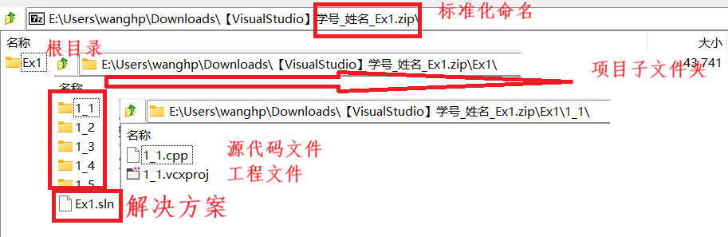
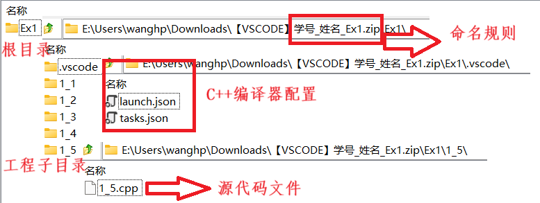

# 实习代码提交要求
实习代码原则上需要包括能够被IDE加载的必须文件，IDE生成的任何中间文件均不需要，如：Debug，Relase，.vs 等等。
## 作业提交
### 提交内容
1. Visual Studio 工程提交 [示例zip下载](../assests/VisualStudio_学号_姓名_Ex1.zip)
- 根目录-解决方案文件 (*.sln)
- 子目录-工程文件 (*.vcxproj)
- 子目录-源代码文件 (*.h,*.cpp)
- Visual Studio 工程内容

2. Visual Source Code 代码提交 [示例zip下载](../assests/VSCode_学号_姓名_Ex1.zip)
- 根目录-配置文件 (.vscode/launch.json,task.json)
- 子目录-源代码文件 (*.h,*.cpp)
- VSCode 工程内容

### 文件命名
1. 严格按照**学号_姓名_Ex1.zip**命名
2. 文件夹布局参考
